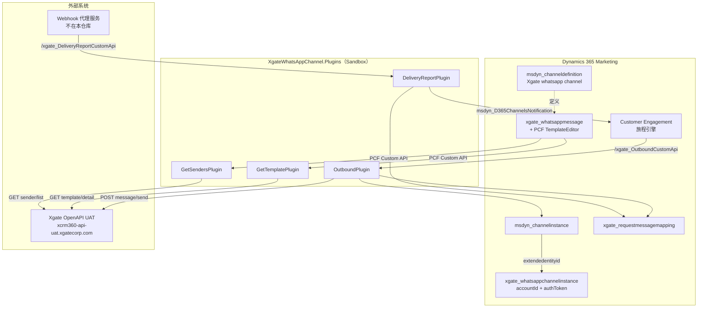

# XgateWhatsAppChannel 架构蓝图

> Dynamics 365 Customer Insights – Journeys（实时营销）自定义 WhatsApp 出站渠道解决方案，通过 **Xgate OpenAPI** 发送 WhatsApp 模板消息。

---

## 1. 概览

| 项目 | 说明 |
|------|------|
| **解决方案唯一名** | `XgateWhatsAppChannel` |
| **版本** | `1.0.0.1`（SolutionPackageVersion 9.2） |
| **发布者 / 前缀** | `xgate`（选项值前缀 `10000`） |
| **打包类型** | Both（托管 + 非托管） |
| **业务定位** | 在 D365 实时营销旅程中，作为自定义渠道向联系人发送 WhatsApp 模板消息 |
| **集成对象** | Xgate OpenAPI（UAT 环境） |
| **前端能力** | PCF 控件（React）可视化配置模板变量 |

**能力边界：**
- ✅ 出站模板消息发送
- ✅ 渠道实例凭证管理
- ✅ PCF 可视化模板变量配置
- ✅ 投递报告回传营销引擎（仅 `delivered`）
- ❌ 入站消息（`msdyn_hasinbound=0`）
- ❌ 附件 / 二进制内容

---

## 2. 目录结构

```
XgateWhatsAppChannel/
├── XgateWhatsAppChannel.cdsproj          # 主解决方案项目（PAC/MSBuild）
├── XgateWhatsAppChannel.Plugins/         # C# 插件源码 (.NET Framework 4.7.1)
│   ├── OutboundPlugin.cs                  # 出站发送
│   ├── DeliveryReportPlugin.cs           # 投递报告回调
│   ├── GetTemplatePlugin.cs              # 拉取模板变量（PCF 调用）
│   ├── GetSendersPlugin.cs              # 拉取发件号列表（PCF 调用）
│   ├── ChannelContracts/                 # D365 渠道契约（Payload/Response）
│   ├── ConsumingApplicationContracts/    # 投递报告契约
│   ├── XgateContracts/                   # Xgate API 契约
│   ├── JsonUtils.cs
│   └── XgateKey.snk                       # 强名称签名
├── XgateWhatsAppControl/                 # PCF 控件项目
│   └── WhatsAppTemplateEditor/
│       ├── index.ts                      # PCF 入口
│       ├── HelloWorld.tsx                # React UI
│       └── ControlManifest.Input.xml
├── src/                                  # 解包后的解决方案元数据
│   ├── Other/
│   │   ├── Solution.xml                  # 解决方案清单 + 根组件
│   │   ├── Customizations.xml            # 渠道定义 + message parts
│   │   └── Relationships/
│   ├── Entities/                         # 5 个实体
│   ├── customapis/                       # 4 个 Custom API
│   └── PluginAssemblies/                 # 编译后 DLL 元数据
├── obj/  bin/                            # 构建产物
```

**构建关系（`XgateWhatsAppChannel.cdsproj`）：**
- `SolutionRootPath` = `src`，`SolutionPackageType` = **Both**
- 引用子项目：`XgateWhatsAppControl.pcfproj`、`XgateWhatsAppChannel.Plugins.csproj`
- 插件 PostBuild 自动复制 DLL 至 `src\PluginAssemblies\...`

---

## 3. 系统架构与数据流



**出站主流程：**
1. 营销旅程引擎按渠道定义调用 `xgate_OutboundCustomApi`
2. `OutboundPlugin` 按 `channelDefinitionId + From` 查询 `msdyn_channelinstance`
3. 经 `msdyn_extendedentityid` 读取 `xgate_whatsappchannelinstance` 的 `xgate_authtoken`
4. 组装请求体调用 Xgate `message/send`
5. 创建 `xgate_requestmessagemapping`（requestId ↔ messageId）
6. 返回状态 `Sent` / `SendingFailed`

**投递回执流程：**
1. 外部 Webhook 代理调用 `xgate_DeliveryReportCustomApi`
2. `DeliveryReportPlugin` 仅处理 `delivered` 状态
3. 用 `MessageSid` 查 `xgate_requestmessagemapping` 得 `requestId`
4. 调用 `msdyn_D365ChannelsNotification` 回写营销引擎

---

## 4. 数据模型（实体）

### 4.1 实体清单

| 逻辑名 | 显示名 | 用途 |
|--------|--------|------|
| `xgate_whatsappmessage` | WhatsApp Message | 核心消息实体（模板 + 变量） |
| `xgate_whatsappchannelinstance` | WhatsApp channel instance | 渠道实例凭证扩展 |
| `xgate_requestmessagemapping` | RequestMessageMapping | requestId ↔ messageId 映射 |
| `xgate_whatsappmessagepartsview` | WhatsApp message parts view | 消息部件 UI 展示 |
| `msdyn_channelinstance` | （标准实体，局部扩展） | 增加 `msdyn_extendedentityid` |

### 4.2 `xgate_whatsappmessage`（核心）

| 字段 | 类型 | 必填 | 说明 |
|------|------|------|------|
| `xgate_name` | nvarchar(850) | 是 | 主名称 |
| `xgate_templateid` | nvarchar(100) | 是 | WhatsApp 模板 ID |
| `xgate_headervariables` | nvarchar(100) | 否 | Header 变量 |
| `xgate_bodyvariables` | nvarchar(100) | 否 | Body 变量（PCF 写入复合 JSON） |

- 主窗体 `90ffd52e-...`，`xgate_bodyvariables` 绑定 PCF `xgate_XgateUI.WhatsAppTemplateEditor`

### 4.3 `xgate_whatsappchannelinstance`（凭证）

| 字段 | 类型 | 必填 | 安全 |
|------|------|------|------|
| `xgate_name` | nvarchar(100) | 是 | 普通 |
| `xgate_accountid` | nvarchar(1000) | 是 | 普通 |
| `xgate_authtoken` | nvarchar(500) | 是 | **字段级安全（IsSecured=1）** |

- 关系：`msdyn_channelinstance.msdyn_extendedentityid` (1:N) → 本实体

### 4.4 `xgate_requestmessagemapping`

| 字段 | 说明 |
|------|------|
| `xgate_requestid` | D365 营销请求 ID |
| `xgate_messageid` | Xgate 返回的消息 ID |

### 4.5 `xgate_whatsappmessagepartsview`

| 字段 | 说明 |
|------|------|
| `xgate_text` | 显示文本（必填） |
| `xgate_placeholders` | 占位符 JSON（ntext，表单隐藏） |

---

## 5. 插件与 Custom API

| 属性 | 值 |
|------|-----|
| **程序集** | `XgateWhatsAppChannel.Plugins` v1.0.0.0 |
| **隔离模式** | Sandbox |
| **目标框架** | .NET Framework 4.7.1 |
| **SDK** | Microsoft.CrmSdk.CoreAssemblies 9.0.2.46 |

**Custom API → 插件绑定：**

| Custom API | 插件类 | 触发方 | 职责 |
|------------|--------|--------|------|
| `xgate_OutboundCustomApi` | `OutboundPlugin` | 营销渠道引擎 | 出站发送 |
| `xgate_DeliveryReportCustomApi` | `DeliveryReportPlugin` | 外部 Webhook 代理 | 投递状态回写 |
| `xgate_GetTemplateCustomApi` | `GetTemplatePlugin` | PCF | 拉取模板变量 |
| `xgate_GetSendersCustomApi` | `GetSendersPlugin` | PCF | 拉取发件号列表 |

**通用契约：** 请求 `payload`（Edm.String，必填）→ 响应 `response`（Edm.String）

**契约类结构：**
```
ChannelContracts/               → Payload / Response / ResponseDetails
ConsumingApplicationContracts/  → DeliveryReport（回写营销）
XgateContracts/                 → XgateDeliveryReport / XgateResponse
```

---

## 6. 前端（PCF 控件）

| 属性 | 值 |
|------|-----|
| **命名空间.构造函数** | `XgateUI.WhatsAppTemplateEditor` |
| **解决方案名** | `xgate_XgateUI.WhatsAppTemplateEditor` |
| **版本 / 类型** | 0.1.2 / virtual（React 16.14.0） |
| **绑定字段** | `xgate_bodyvariables` |

**交互流程：**
1. 调用 `xgate_GetSendersCustomApi` 加载发件号下拉
2. 输入 Template ID → `xgate_GetTemplateCustomApi` 获取变量列表
3. 动态渲染变量输入框
4. 输出复合 JSON：`{ senderId, templateId, variables: {...} }` 到 `xgate_bodyvariables`

---

## 7. 渠道定义

| 配置项 | 值 |
|--------|-----|
| **ChannelDefinitionId** | `702c7021-cf32-4fcd-be63-b3373f27906b` |
| **显示名 / 类型** | Xgate whatsapp channel / Custom |
| **外部实体** | `xgate_whatsappchannelinstance` |
| **消息窗体** | `90ffd52e-b52e-4379-8ad5-80681f6bf3b7` |
| **出站端点** | `/xgate_OutboundCustomApi` |
| **支持账户 / 入站 / 回执** | 是 / 否 / 否 |

**消息部件（Message Parts）：**

| 名称 | 逻辑名 | 最大长度 |
|------|--------|----------|
| Template ID | `xgate_templateid` | 100 |
| Header Variables | `xgate_headervariables` | 2000 |
| Body Variables | `xgate_bodyvariables` | 4000 |

---

## 8. 外部集成（Xgate OpenAPI）

**端点（硬编码于插件，UAT 环境）：**

| 用途 | 方法 | URL |
|------|------|-----|
| 发送消息 | POST | `https://xcrm360-api-uat.xgatecorp.com/whatsapp/openapi/message/send` |
| 模板详情 | GET | `.../whatsapp/openapi/template/detail?templateId={id}` |
| Sender 列表 | GET | `.../whatsapp/openapi/sender/list` |

**鉴权：** `Authorization: Bearer {xgate_authtoken}`

**出站请求体：**
```json
{
  "senderId": 123,
  "receiverPhoneNumber": "<To>",
  "message": {
    "type": "whatsapp_template",
    "templateId": 456,
    "templateParams": {
      "header": { },
      "body": { "variables": { } }
    }
  }
}
```

**Xgate 响应：**
```json
{ "code": 0, "message": "...", "data": { "messageId": "..." } }
```

---

## 9. 安全与配置

| 项目 | 现状 |
|------|------|
| **安全角色** | 无（部署后需手动授权 Custom API / 实体权限） |
| **字段级安全** | 仅 `xgate_authtoken`（IsSecured=1），需配置 Field Security Profile |
| **凭证存储** | Auth Token 存于实体字段，注释提示生产环境需加密 |
| **全局选项集** | 无；各实体仅标准 statecode/statuscode |

---

## 10. 部署清单（建议）

1. 构建并导入解决方案（`XgateWhatsAppChannel.cdsproj` → 托管/非托管）
2. 注册并激活 4 个 Custom API 对应的插件程序集（Sandbox）
3. 创建 `xgate_whatsappchannelinstance` 记录，填入 Xgate `accountId` 与 `authToken`
4. 关联标准 `msdyn_channelinstance.msdyn_extendedentityid`
5. 配置 `xgate_authtoken` 的 Field Security Profile
6. 为运行用户/团队分配 Custom API 与实体权限
7. 部署外部 Webhook 代理服务，指向 `xgate_DeliveryReportCustomApi`
8. 在营销旅程中启用 "Xgate whatsapp channel" 渠道
